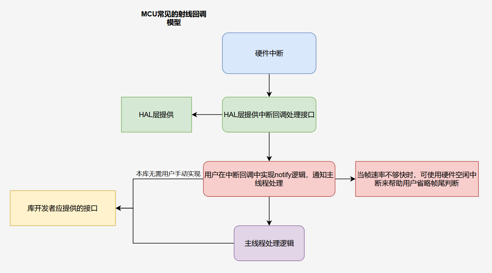

# BufferHandler DMA-多缓冲区库
 
**描述：**  
该库用于 STM32 系列 MCU 实现的双缓冲区数据接收与处理。利用 DMA 接收数据，并通过“乒乓缓冲区”机制，在串口（USART）空闲或者传输过半时触发数据接收回调，实现连续数据接收和处理。该库仅适用于 STM32 平台。

## 特性

- **双缓冲区设计：** 使用两个缓冲区进行交替数据传输，保证数据不会丢失。
- **DMA 接收：** 利用 HAL 库中的 DMA 接口，极大降低 CPU 占用。
- **事件机制：** 提供回调函数注册接口，实现数据到达后的自定义处理逻辑。
- **简易集成：** 只需在初始化时调用 `begin`，并在 HAL 的 UART 回调中调用 `callbackHandler` 即可。

## 文件说明

- **BufferHandler.h**  
  定义了 BufferHandler 类及其接口，同时定义了数据处理所需的枚举和回调函数类型。

- **BufferHandler.cpp**  
  实现了 BufferHandler 类的各个成员函数，包括 DMA 启动、数据回调处理和事件触发机制。

- **main.cpp**  
  示例代码，展示如何初始化 BufferHandler 库、注册回调函数以及在主循环中调用数据处理函数 `processHandler`。

## 接口说明

### `void begin(uint16_t buffer_num, uint8_t buffer_len, UART_HandleTypeDef *huart)`

- **描述：**  
  初始化缓冲区及 DMA 接收，分配指定数量和长度的缓冲区，并配置关联的 UART 接口。

- **参数：**  
  - `buffer_num`：缓冲区数量（例如双缓冲，传入 2）。
  - `buffer_len`：每个缓冲区的大小。
  - `huart`：对应的 UART 句柄指针。

- **使用场景：**  
  在系统初始化时调用，确保缓冲区和 DMA 都已经配置好。

### `void callbackHandler(UART_HandleTypeDef *huart, uint16_t Size)`

- **描述：**  
  在 HAL UART 回调中调用，将接收到的数据帧大小记录下来，并标记数据可用，同时启动下次 DMA 接收。

- **参数：**  
  - `huart`：当前触发中断的 UART 句柄。
  - `Size`：DMA 接收到的数据总字节数。

- **使用场景：**  
  可在 `HAL_UARTEx_RxEventCallback` 中调用。

### `void attachEvent(BufferCallback cb, ProcessEvent event)`

- **描述：**  
  注册一个回调函数，用于处理接收到的数据。当指定事件触发时会调用该回调函数。

- **参数：**  
  - `cb`：回调函数指针，格式为 `void (*BufferCallback)(uint8_t *data, uint16_t len)`。
  - `event`：回调事件枚举，目前支持 `PINGPONG_BUFFER`。

- **使用场景：**  
  在应用层注册数据处理逻辑。

### `void stopEvent(BufferCallback cb, ProcessEvent event)`

- **描述：**  
  注销指定的回调函数，使得对应事件时不再调用该回调函数。

- **参数：**  
  - `cb`：之前注册的回调函数指针。
  - `event`：对应的事件枚举。

### `void processHandler()`

- **描述：**  
  在主循环中使用，用于检查数据是否到达并调用相应的回调函数进行处理。

- **使用场景：**  
  定期调用该函数以处理 DMA 接收的数据。

## 使用示例

在 `main.cpp` 中使用 BufferHandler 的基本流程如下：

1. 初始化系统和外设（包括 GPIO、DMA、USART 等）。
2. 调用 `BufferHandler.begin(2, 50, &huart1)` 初始化双缓冲，每个缓冲区大小为 50 字节。
3. 使用 `attachEvent` 注册数据处理函数，例如 `vofaMessageProcess`。
4. 在 HAL 的 UART 回调中调用 `callbackHandler` 通知 BufferHandler 数据已接收。
5. 在主循环中调用 `processHandler` 处理并触发注册的回调函数。

**示例代码片段：**

```cpp
// main.cpp 文件片段
#include "BufferHandler.h"

BufferHandler vofaHandler;

void HAL_UARTEx_RxEventCallback(UART_HandleTypeDef *huart, uint16_t Size)
{
    vofaHandler.callbackHandler(huart, Size);
}

void vofaMessageProcess(uint8_t *data, uint16_t len) {
    for (int i = 0; i < len; i++) {
        printf("%c\n", *(data + i));
    }
}

int main(void)
{
    HAL_Init();
    SystemClock_Config();
    MX_GPIO_Init();
    MX_DMA_Init();
    MX_USART1_UART_Init();

    // 注册处理 "乒乓缓冲区" 事件的回调函数
    vofaHandler.attachEvent(vofaMessageProcess, PINGPONG_BUFFER);
    // 初始化双缓冲区管理器
    vofaHandler.begin(2, 50, &huart1);


    while (1)
    {
        // 定期检查处理数据
        vofaHandler.processHandler();
    }
}
```
## 注意事项
* 该库专用于 STM32 平台，依赖 STM32 HAL 库中的 UART 和 DMA 接口。
* 在调用 begin 时，必须确保传入有效的 UART 句柄及合理的缓冲区参数，否则不会启动 DMA 接收。
* 注册的回调函数应确保处理接收到的数据时不会阻塞，从而影响系统的实时性。
* 若不需要继续处理某事件，可以调用 stopEvent 注销相应的回调。